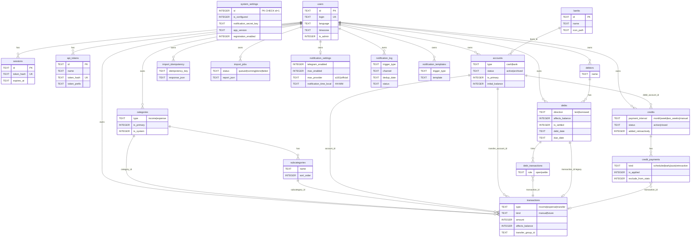

# Модель данных

Схема БД — **SQLite**. Источник правды по миграциям: `server/internal/db/migrations/` (goose).  
Снимок для [sqlc](https://sqlc.dev): `server/schema.sql` (обновлять после каждой миграции).

Доступ к данным — через sqlc-запросы в `server/queries/`, без ORM.

## Диаграмма (схема v1)

Все **19** таблиц из `server/schema.sql`:

`system_settings` — глобальная строка `id = 1`, без `user_id`.  
Переводы: две ноги в `transactions` с общим `transfer_group_id` (самоссылка, не отдельная таблица).

## Категории и иконки

Категории и подкатегории хранят поле `icon` — строковый ID из каталога [`data/category_icons.json`](../data/category_icons.json) (не FK в БД).

Подробно: [categories-and-icons.md](categories-and-icons.md).

## Операции и переводы

- Пара перевода: `transfer_group_id`, исходящая нога — первая по `created_at`.
- Создание перевода — в одной транзакции БД (`BeginTx` + откат при ошибке второй ноги).
- В API-ответах: `transfer_account_name`, `transfer_is_out` (вычисляемые поля, не колонки таблицы).
- UI: [transactions-display.md](transactions-display.md).

## Долги и операции

- **Один должник — одно направление:** у человека не может быть одновременно активных (`is_settled=0`) долгов `lent` и `borrowed` → **409 Conflict**.
- `debts.transaction_id` — ссылка на начальную (`open`) операцию; полный список — в `debt_transactions`.
- `DELETE /debts/{id}` — каскадно снимает связи и удаляет привязанные `transactions`.
- `DELETE /transactions/{id}` для связанной операции — запрещено (409), если есть погашения (`role=settle`).

## Кредиты и операции

- `credits.payment_interval`: `month` | `week` | `two_weeks` | `manual`
- `credit_payments.kind`: `scheduled`, `auto`, `retroactive`; `early` — legacy
- `transactions.affects_balance` — `0` при завершении кредита «без учёта в балансе»
- Автосписание: `server/internal/scheduler` в полночь по `users.timezone`

Подробнее: [ui-credits.md](ui-credits.md).

## Счета

| Поле | Описание |
|------|----------|
| `accounts.is_primary` | `1` — основной счёт среди `status = active`; не более одного на пользователя |
| API | `POST /api/v1/accounts/{id}/primary` |

## Изоляция данных

Все пользовательские сущности имеют `user_id`. В каждом запросе обязателен фильтр `user_id = ?` из контекста авторизации.

## Деньги и даты

| Поле | Тип в БД | Примечание |
|------|----------|------------|
| Суммы | `INTEGER` | копейки (минорные единицы) |
| Даты/время | `TEXT` | UTC, `YYYY-MM-DD HH:MM:SS` в API |

## Пакеты и sqlc-запросы

| Сущность | Go-пакет | sqlc (`server/queries/`) |
|----------|----------|---------------------------|
| accounts | `internal/account` | `accounts.sql` |
| banks | `internal/bank` | `banks.sql` |
| categories | `internal/category` | `categories.sql` |
| transactions | `internal/transaction` | `transactions.sql` |
| debtors, debts | `internal/debt` | `debts.sql` |
| credits | `internal/credit` | `credits.sql` |
| stats / search | `internal/stats` | `stats.sql` |
| import / export | `internal/importexport` | `import.sql` |

## Защита от SQL-инъекций

1. Параметризованные запросы — значения только через `?`.
2. sqlc — SQL в `.sql`-файлах, параметры типизированы.
3. Сортировка и фильтры — фиксированные варианты в коде, не с клиента.

## Обновление схемы

**Соглашение (с v1):** одна миграция goose — **одна таблица** (`CREATE` + индексы, или `ALTER` только её). Имя: `NNN_<table>.sql`.

1. Добавить миграцию в `server/internal/db/migrations/`.
2. Обновить `server/schema.sql`.
3. Добавить/изменить запросы в `server/queries/`.
4. `make sqlc` → закоммитить `server/internal/db/sqlc/`.

После первого стабильного релиза уже применённые миграции **не переписывать** — только новые файлы в конец цепочки.

## Миграции (цепочка v1)

В текущей цепочке — **19** файлов, по одной таблице на миграцию:

| # | Файл | Таблица |
|---|------|---------|
| 001 | `001_system_settings.sql` | `system_settings` (+ seed `id=1`) |
| 002 | `002_users.sql` | `users` |
| 003 | `003_sessions.sql` | `sessions` |
| 004 | `004_api_tokens.sql` | `api_tokens` |
| 005 | `005_banks.sql` | `banks` |
| 006 | `006_accounts.sql` | `accounts` |
| 007 | `007_categories.sql` | `categories` |
| 008 | `008_subcategories.sql` | `subcategories` |
| 009 | `009_transactions.sql` | `transactions` |
| 010 | `010_debtors.sql` | `debtors` |
| 011 | `011_debts.sql` | `debts` |
| 012 | `012_debt_transactions.sql` | `debt_transactions` |
| 013 | `013_credits.sql` | `credits` |
| 014 | `014_credit_payments.sql` | `credit_payments` |
| 015 | `015_import_idempotency.sql` | `import_idempotency` |
| 016 | `016_import_jobs.sql` | `import_jobs` |
| 017 | `017_notification_settings.sql` | `notification_settings` |
| 018 | `018_notification_log.sql` | `notification_log` |
| 019 | `019_notification_templates.sql` | `notification_templates` |

Новые изменения схемы после релиза — только `020_*.sql`, `021_*.sql`, … в конец цепочки.
