# Модель данных

Схема БД — **SQLite**. Источник правды по миграциям: `server/internal/db/migrations/` (goose).  
Снимок для [sqlc](https://sqlc.dev): `server/schema.sql` (обновлять после каждой миграции).

Доступ к данным в production-коде — через [sqlc](https://sqlc.dev)-запросы в `server/queries/`, без ORM.  
Правила размещения SQL: [sql-access.md](sql-access.md).

## Диаграмма

Основные таблицы из `server/schema.sql` (актуальный снимок для sqlc):

```mermaid
erDiagram
    system_settings {
        INTEGER id "PK CHECK id=1"
        INTEGER is_configured
        TEXT notification_secret_key
        TEXT app_version
        INTEGER registration_enabled
    }

    users {
        TEXT id PK
        TEXT login UK
        TEXT language
        TEXT timezone
        INTEGER is_admin
        TEXT status
    }

    sessions {
        TEXT id PK
        TEXT token_hash UK
        TEXT expires_at
    }

    api_tokens {
        TEXT id PK
        TEXT name
        TEXT token_hash UK
        TEXT token_prefix
    }

    banks {
        TEXT id PK
        TEXT name
        TEXT icon_path
    }

    accounts {
        TEXT type "cash|bank|credit_card"
        TEXT status "active|archived"
        INTEGER is_primary
        INTEGER initial_balance
    }

    categories {
        TEXT type "income|expense"
        INTEGER is_primary
        INTEGER is_system
    }

    subcategories {
        TEXT name
        INTEGER sort_order
    }

    transactions {
        TEXT type "income|expense|transfer"
        TEXT kind "manual|future"
        INTEGER amount
        INTEGER affects_balance
        TEXT transfer_group_id
    }

    recurring_operations {
        TEXT type "income|expense"
        TEXT period "week|two_weeks|month|year"
        TEXT time_local "HH:MM"
        TEXT next_run_at
    }

    budgets {
        TEXT scope "category|subcategory|all_expense|all_income"
        TEXT month "YYYY-MM"
        INTEGER copy_forward
        INTEGER amount
        INTEGER alert_at_percent "default 90"
        INTEGER is_active
    }

    budget_periods {
        TEXT period_start
        INTEGER planned_amount
        INTEGER rollover_amount
    }

    budget_alert_sent {
        INTEGER threshold_percent
    }

    password_reset_requests {
        TEXT user_id UK
        TEXT dismissed_at
    }

    debtors {
        TEXT name
    }

    debts {
        TEXT direction "lent|borrowed"
        INTEGER affects_balance
        INTEGER is_settled
        TEXT debt_date
        TEXT due_date
    }

    debt_transactions {
        TEXT role "open|settle"
    }

    credits {
        TEXT payment_interval "month|week|two_weeks|manual"
        TEXT status "active|closed"
        INTEGER added_retroactively
    }

    credit_payments {
        TEXT kind "scheduled|early|auto|retroactive"
        INTEGER is_applied
        INTEGER exclude_from_stats
    }

    import_idempotency {
        TEXT idempotency_key
        TEXT response_json
    }

    import_jobs {
        TEXT status "queued|running|done|failed"
        TEXT report_json
    }

    notification_settings {
        INTEGER telegram_enabled
        INTEGER max_enabled
        TEXT max_provider "a161|official"
        TEXT notification_time_local "HH:MM"
    }

    notification_log {
        TEXT trigger_type
        TEXT channel
        TEXT dedup_date
        TEXT status
    }

    notification_templates {
        TEXT trigger_type
        TEXT template
    }

    budgets {
        TEXT scope "category|subcategory|all_expense|all_income"
        TEXT month "YYYY-MM"
        INTEGER copy_forward
        INTEGER amount
        INTEGER alert_at_percent "default 90"
        INTEGER is_active
    }

    budget_periods {
        TEXT period_start
        INTEGER planned_amount
        INTEGER rollover_amount
    }

    budget_alert_sent {
        INTEGER threshold_percent
    }

    users ||--o{ budgets : owns
    budgets ||--o{ budget_periods : has
    budgets ||--o{ budget_alert_sent : alerts
    categories ||--o{ budgets : category_id
    subcategories ||--o{ budgets : subcategory_id
    accounts ||--o{ budgets : account_id

    users ||--o{ sessions : has
    users ||--o{ api_tokens : has
    users ||--o{ accounts : owns
    users ||--o{ categories : owns
    users ||--o{ transactions : owns
    users ||--o{ recurring_operations : owns
    users ||--o{ budgets : owns
    users ||--o| password_reset_requests : "pending reset"
    users ||--o{ debtors : owns
    users ||--o{ debts : owns
    users ||--o{ credits : owns
    users ||--o| notification_settings : owns
    users ||--o{ notification_templates : owns
    users ||--o{ notification_log : owns
    users ||--o{ import_idempotency : owns
    users ||--o{ import_jobs : owns

    banks ||--o{ accounts : bank_id
    categories ||--o{ subcategories : has
    categories ||--o{ transactions : category_id
    subcategories ||--o{ transactions : subcategory_id
    accounts ||--o{ transactions : account_id
    accounts ||--o{ transactions : transfer_account_id
    accounts ||--o{ credits : debit_account_id

    budgets ||--o{ budget_periods : has
    budgets ||--o{ budget_alert_sent : alerts
    categories ||--o{ budgets : category_id
    subcategories ||--o{ budgets : subcategory_id
    accounts ||--o{ budgets : account_id

    debtors ||--o{ debts : has
    debts ||--o{ debt_transactions : links
    debt_transactions }o--|| transactions : transaction_id
    debts ||--o| transactions : "transaction_id legacy"

    credits ||--o{ credit_payments : has
    credit_payments }o--o| transactions : transaction_id
```

`system_settings` — глобальная строка `id = 1`, без `user_id`.  
Переводы: две ноги в `transactions` с общим `transfer_group_id` (самоссылка, не отдельная таблица).

## Категории и иконки

Категории и подкатегории хранят поле `icon` — строковый ID из каталога [`data/category_icons.json`](../data/category_icons.json) (не FK в БД).

Подробно: [categories-and-icons.md](categories-and-icons.md).

## Операции и переводы

- Пара перевода: `transfer_group_id`, исходящая нога — первая по `created_at`.
- Создание перевода — в одной транзакции БД (`BeginTx` + откат при ошибке второй ноги).
- **Комиссия (v1.1):** опциональное поле `commission` при создании/изменении перевода; отдельная нога `expense` на счёте-источнике в системной категории «Комиссия».
- В API-ответах: `transfer_account_name`, `transfer_is_out`, `commission`, `commission_display` (вычисляемые/агрегированные поля).
- UI: [transactions-display.md](transactions-display.md).

## Долги и операции

- **Один должник — одно направление:** у человека не может быть одновременно активных (`is_settled=0`) долгов `lent` и `borrowed` → **409 Conflict**.
- `debts.transaction_id` — ссылка на начальную (`open`) операцию; полный список — в `debt_transactions`.
- `POST /debts/{id}/settle`: `affects_balance` и `account_id` в теле запроса **не зависят** от флага долга при создании. При `affects_balance=true` — обратная операция на указанном счёте; при `false` — долг закрывается (или уменьшается) без операции по счёту.
- `DELETE /debts/{id}` — каскадно снимает связи и удаляет привязанные `transactions`.
- `DELETE /transactions/{id}` для начальной (`open`) операции — удаляет долг, если это единственная связанная операция; иначе **409 Conflict**.
- `DELETE /transactions/{id}` для операции погашения (`settle`) — пересчитывает остаток долга и баланс счёта.

## Уведомления

- `notification_settings.trigger_negative_balance` — дописывать суффикс о недостатке средств к исходящим напоминаниям (кредит, плановый расход/перевод, долг «я должен»).
- `notification_settings.trigger_budget` — уведомления `budget_threshold` при достижении порога лимита (см. [budget.md](budget.md)).
- `notification_templates.trigger_type` включает `balance_shortfall` — шаблон суффикса с placeholder `{amount}` (недостающая сумма); редактирование в API/UI только при включённом связанном переключателе в блоке «Настройки» (долги → `debt_*`, кредиты → `credit_payment`, и т.д.).
- Блокировка периодов и расписания при выключенном toggle — [notifications.md](notifications.md).
- Подробнее о недостатке средств: [balance-shortfall-notifications.md](../roadmap/balance-shortfall-notifications.md).

## Кредиты и операции

- `credits.credit_kind`: `consumer` | `mortgage` (ипотека: `property_price`, `down_payment`, сумма кредита = `property_price - down_payment`; потребкредит: опционально `principal_affects_balance` — доход на счёт при создании)
- `credits.payment_interval`: `month` | `week` | `two_weeks` | `manual` (для ипотеки — только `month`)
- `credit_payments.kind`: `scheduled`, `auto`, `retroactive`; `early` — legacy
- График ипотеки: ежедневное начисление процентов; автоплатёж через `MonthlyPaymentMortgage`, ручной — через `monthly_payment` в create/preview (отдельный алгоритм, без отклонения «слишком высокого» платежа)
- График потребительского кредита: аннуитет с проверкой ручного `monthly_payment` (минимум — покрытие процентов, максимум — укладывание в срок)
- `POST /credits/schedule/preview` — предпросмотр графика без сохранения; ответ: `schedule_preview`, `calculated_monthly_payment`
- При создании с `added_retroactively`: прошлые платежи → `retroactive`; опционально `retroactive_debit_count` — последние N ретро-платежей со списанием на счёт (`transaction_id`, `exclude_from_stats=0`)
- `PATCH /credits/{id}/schedule` — правка сумм неоплаченных `scheduled` (v1.1)
- При старте: `RepairShortSchedules` дополняет неполные графики (миграция-маркер `020`)
- `transactions.affects_balance` — `0` при завершении кредита «без учёта в балансе»
- Автосписание: `server/internal/scheduler` по `debit_time_local` в `users.timezone`; `transactions.transaction_date` — дата платежа + это время (UTC в БД)

Подробнее: [ui-credits.md](ui-credits.md).

## Счета

| Поле | Описание |
|------|----------|
| `accounts.type` | `cash`, `bank`, `credit_card` |
| `accounts.credit_limit` | лимит кредитной карты, копейки; только для `credit_card` |
| `accounts.payment_account_id` | счёт по умолчанию для переводов на карту (опционально) |
| `accounts.is_primary` | `1` — основной счёт среди `status = active`; не более одного на пользователя |
| API | `POST /api/v1/accounts/{id}/primary` |

Подробнее о типе `credit_card`: [ui-credit-cards.md](ui-credit-cards.md).

## Бюджет

| Таблица | Назначение |
|---------|------------|
| `budgets` | Лимит на месяц (`month`): scope, сумма, `copy_forward`, порог уведомления, `is_active` |
| `budget_periods` | Снимок на месяц: `planned_amount`, `rollover_amount` (rollover — post-MVP) |
| `budget_alert_sent` | Дедупликация уведомлений `budget_threshold` |

- Факт (`spent`) не денормализуется — запрос к `transactions` с теми же предикатами, что `StatsByCategory`.
- Уникальность: один активный бюджет на `(user_id, scope, category_id, subcategory_id, month)` — без `account_id` (см. `039_budget_scope_unique.sql`).
- Периоды создаются лениво при `GET summary`.

Подробнее: [budget.md](budget.md).

## Изоляция данных

Все пользовательские сущности имеют `user_id`. В каждом запросе обязателен фильтр `user_id = ?` из контекста авторизации.

## Деньги и даты

| Поле | Тип в БД | Примечание |
|------|----------|------------|
| Суммы | `INTEGER` | копейки (минорные единицы) |
| Даты/время | `TEXT` | UTC, `YYYY-MM-DD HH:MM:SS` в API |

## Пакеты и sqlc-запросы

| Сущность | Go-пакет | sqlc (`server/queries/`) | Статус |
|----------|----------|---------------------------|--------|
| accounts | `internal/account` | `accounts.sql` | sqlc |
| banks | `internal/bank` | `banks.sql` | sqlc |
| categories | `internal/category` | `categories.sql` | sqlc |
| transactions | `internal/transaction` | `transactions.sql` | sqlc |
| debtors, debts | `internal/debt` | `debts.sql` | sqlc |
| credits | `internal/credit` | `credits.sql` | sqlc |
| stats / search | `internal/stats` | `stats.sql` | sqlc |
| budgets | `internal/budget` | `budget.sql` | sqlc |
| recurring | `internal/recurring` | `recurring_operations.sql` | sqlc |
| budget | `internal/budget` | `budget.sql` | sqlc |
| notifications | `internal/notify` | `notifications.sql` | sqlc |
| import / export | `internal/importexport` | `import.sql` | sqlc |
| users | `internal/auth`, `internal/user`, `internal/admin`, `internal/setup` | `users.sql` | sqlc |
| sessions | `internal/auth` | `sessions.sql` | sqlc |
| api_tokens | `internal/auth`, `internal/user` | `api_tokens.sql` | sqlc |
| password_reset | `internal/auth` | `password_reset_requests.sql` | sqlc |
| system_settings | `internal/admin`, `internal/auth`, `internal/settingscache`, `internal/backup`, `internal/notify`, `internal/db`, `cmd/buhgalter`, `internal/setup` | `system_settings.sql` | sqlc |

Колонка «Статус»: **sqlc** — запросы в `server/queries/`; исключения — см. [sql-access.md](sql-access.md).

## Защита от SQL-инъекций

1. Параметризованные запросы — значения только через `?`.
2. sqlc — SQL в `.sql`-файлах, параметры типизированы.
3. Сортировка и фильтры — фиксированные варианты в коде, не с клиента.

## Обновление схемы

**Соглашение (с v1):** одна миграция goose — **одна таблица** (`CREATE` + индексы, или `ALTER` только её). Имя: `NNN_<table>.sql`.

1. Добавить миграцию в `server/internal/db/migrations/`.
2. Обновить `server/schema.sql`.
3. Добавить/изменить запросы в `server/queries/`.
4. `make sqlc` → закоммитить `server/internal/db/sqlc/`.

После первого стабильного релиза уже применённые миграции **не переписывать** — только новые файлы в конец цепочки.

## Миграции

Цепочка goose: `server/internal/db/migrations/` (нумерация `001_`, `002_`, …).

- Первые миграции `001`–`019` — по одной таблице на файл (`CREATE` + индексы).
- Дальше — `ALTER`, repair-маркеры и новые таблицы, например:
  - `020_repair_credit_schedules.sql` — repair неполных графиков при старте
  - `023_password_reset_requests.sql` — очередь сброса пароля
  - `026_recurring_operations.sql` — периодические операции
  - `034_budgets.sql` … `039_budget_scope_unique.sql` — бюджет (см. [budget.md](budget.md))
  - `024_`, `027_`, `028_` — поля кредитов, ипотеки, `accounts.current_balance`

Уже применённые миграции **не переписывать** — только новые файлы в конец цепочки. После каждой миграции обновлять `server/schema.sql` и при необходимости запускать `make sqlc`.
