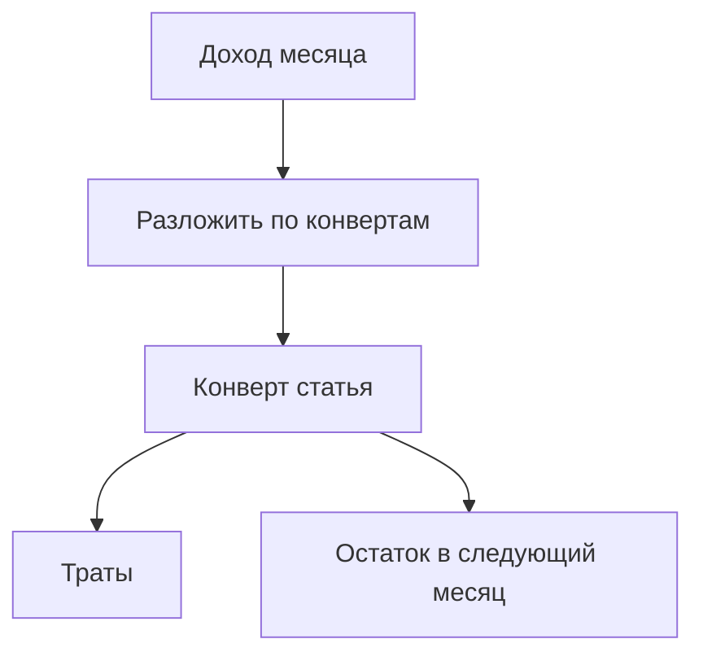

# Бюджет дальше MVP: перенос остатка, прогноз, конверты

Планируется в **v1.5.0** ([ROADMAP](../ROADMAP.md#v150)).

MVP бюджета уже в **v1.3.0** — [docs/budget.md](../docs/budget.md), исходный план [budget.md](budget.md).

## Что уже есть

- Лимит на месяц, факт (spent), порог уведомления, копирование лимитов на следующий месяц (`copy_forward`).
- **`copy_forward` ≠ перенос остатка:** копирование переносит тот же плановый лимит; rollover переносит **непотраченные деньги**.

## 1. Перенос остатка (rollover)

Если в июне лимит 10 000, потратили 7 000 → 3 000 переходят в июль: доступно = лимит июля + хвост июня.

- Флаг на бюджете `rollover` on/off.
- При открытии месяца: `rollover_amount = max(0, planned − spent)`.
- В UI: «лимит», «перенесено», «доступно».
- Перерасход **не** уносить отрицательным хвостом (только положительный остаток).

Задел в модели: `budgets.rollover`, `budget_periods.rollover_amount` (см. [budget.md](budget.md)); в коде копирования rollover пока обнуляется.

## 2. Прогноз из периодических

До конца месяца: `forecast ≈ spent + сумма подходящих периодических` в оставшиеся дни.

UI: «с учётом периодических» рядом с «потрачено / осталось». Не путать с прогнозом баланса счёта на главной.

## 3. Конверты (в духе Actual / YNAB)

**Смысл:** каждый рубль из дохода заранее кладётся в «конверт» (статью бюджета). Тратить можно только то, что в конверте. Непотраченное переезжает (см. rollover). Лимиты упираются в **реальный доход**, а не в цифры «с потолка».

| Сейчас (лимит vs факт) | Конверты |
|------------------------|----------|
| Лимит на еду 30 000 при любом доходе | В «еду» кладёшь только деньги, которые реально есть |
| Новый месяц часто = снова тот же лимит | Остаток конверта переезжает |
| Легко поставить нереалистичные лимиты | Дисциплина: сначала разложи доход |

В **v1.5.0** цель — приблизиться:

1. Перенос остатка (обязательный кусок конвертов).
2. Явная семантика «доступно в конверте» в UI (лимит + перенесено − spent).
3. По возможности: «сколько ещё можно разложить» из доходов месяца (упрощённый zero-based) — если успеем; иначе сразу после rollover+прогноза.

Полная копия YNAB (перетаскивание между конвертами, сложный «доступно к распределению») — не обязана войти целиком в 1.5.0; зафиксировать минимально полезный UX.

## Не входит в этот пункт

- Scope `all_income` / группы категорий в одном лимите (см. [budget.md](budget.md)).
- Крипта / инвестиции.

## Порядок

1. Прогноз из периодических (быстрее по UX).
2. Rollover + отображение «доступно».
3. Конверты: дожать формулировки UI и (если успеем) распределение дохода.

Оба клиента + OpenAPI + [docs/budget.md](../docs/budget.md) / [ui-budget.md](../docs/ui-budget.md).
