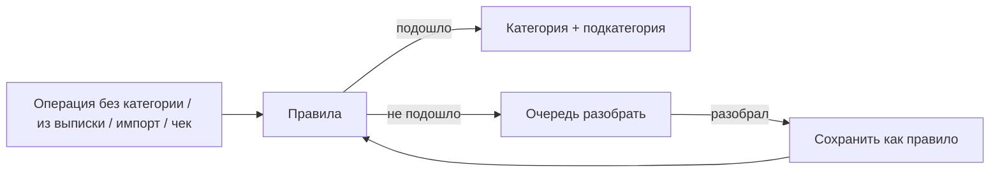

# Правила категорий и очередь «неразнесённых»

Планируется в **v1.5.0** ([ROADMAP](../ROADMAP.md#v150)). Web + Android + сервер.

Авторазметка операций по правилам пользователя и очередь того, что нужно разобрать вручную. Соседи: [выписка банка](bank-sync.md), [перехват уведомлений](notification-intercept.md), [сканер чеков](receipt-scanner.md), [магазины](merchants-tags.md).

## Пример

Выбрал категорию **«Транспорт»** → подкатегорию **«Автобус»** → в форме **сам подставляется счёт «Наличные»**.

То есть правило: категория/подкатегория → счёт по умолчанию (не наоборот «текст + счёт → категория»).

Другие направления правил тоже возможны (описание/магазин → категория) — см. ниже; пример с автобусом — про автовыбор счёта.

## Что уже есть (это не то же самое)

При файловом импорте есть **разовый** маппинг имён внутри прогона — не сохраняется как постоянные правила и нет очереди «хвоста».

## 1. Правила

| Условие (примеры) | Действие |
|-------------------|----------|
| категория + подкатегория (транспорт → автобус) | → счёт «Наличные» (подстановка в форме) |
| описание / комментарий содержит текст | → категория (+ подкатегория) |
| магазин / контрагент (когда появится) | → категория |

Срабатывание: создание операции, импорт, будущая выписка/уведомления; опционально «прогнать по истории».

Правила per-user, приоритет; системные категории не назначать как попало.

## 2. Очередь «разобрать»

Список операций без категории (или отложенных). Действия: назначить категорию; **«всегда так»** → создать правило; пропустить.

Счётчик в меню / на главной. Не путать с offline-очередью Android и с модерацией пользователей.

## MVP v1.5.0

1. Модель правил + API CRUD.
2. Правило «категория/подкатегория → счёт по умолчанию» (пример: транспорт / автобус → наличные).
3. Match по подстроке в описании → категория (второй тип правил).
4. Экран очереди без категории.
5. Из очереди: категория + опционально сохранить правило.
6. Подсказка / автоподстановка при ручном вводе.

## Позже

Regex, прогон по истории, глубокая интеграция с выпиской и перехватом уведомлений.

## Открытые вопросы

- [ ] Нужна ли категория-заглушка «Неразнесённое» или достаточно `category_id IS NULL`?
- [ ] Автоприменение при create — молча или только подсказка?
