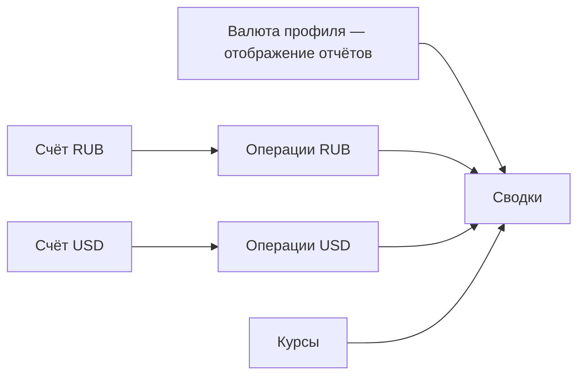

# Валюта счёта (отдельно от валюты профиля)

Планируется в **v1.5.0** ([ROADMAP](../ROADMAP.md#v150)).

## Что есть сегодня

- У пользователя `users.currency` — **валюта отображения** в профиле (подпись к суммам).
- У счетов/операций своего кода валюты **нет**; все суммы — «копейки одной логической валюты».
- Смена валюты в профиле меняет символ, **не** конвертирует историю и не создаёт счета в другой валюте.

## Что нужно

Валюта **на счёте**, отдельно от валюты аккаунта (профиля):

| Возможность | Суть |
|-------------|------|
| `accounts.currency` | У каждого счёта свой код (RUB / USD / EUR / …); backfill из `users.currency` |
| Операции | В валюте счёта; нельзя молча суммировать разные валюты |
| Сводки | По валютам раздельно и/или пересчёт в валюту отчёта (профиль) с курсом |
| Перевод между валютами | Курс вручную или запрет в первой версии (открытый вопрос) |
| Курсы | Хранение курса на обмене; источник позже (ЦБ / ручной) |

## MVP v1.5.0

1. Поле валюты на счёте + миграция.
2. UI создания/редактирования счёта; балансы не суммировать разные валюты без пересчёта.
3. Перевод в одной валюте — как сейчас; между разными — обмен с ручным курсом **или** запрет до следующей итерации.
4. Дашборд/статистика: хотя бы раздельные итоги по валютам.

## Не имеется в виду

- Только новые коды в селекторе профиля без валюты на счёте.
- Крипта ([crypto.md](crypto.md)).

## Риски

- Ломающее изменение API и агрегатов.
- Импорт Cubux уже знает колонки валют — опереться при маппинге.
- Связь с выписками банков ([bank-sync.md](bank-sync.md)).

**Открытый вопрос:** запретить cross-currency transfer в 1.5.0 или сразу обмен с ручным курсом.
