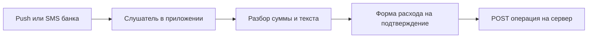

# Перехват уведомлений банка (Android)

Планируется в **v1.6.0** ([ROADMAP](../ROADMAP.md#v160)).

## Зачем

В РФ у многих банков нет удобного открытого API для физлиц, но приходят **push / SMS** о списании. Если Android-клиент (с явного разрешения пользователя) читает такие уведомления, можно предложить создать расход: сумма, магазин, счёт — без ручного ввода и без зарубежного bank sync.

Ориентир — **только банки и сценарии внутри РФ**. Зарубежные агрегаторы (Plaid и т.п.) не рассматриваем.

## Scope (v1.6.0)

| Возможность | Суть |
|-------------|------|
| Разрешение | Android Notification Listener (или аналог) — только после явного opt-in в настройках |
| Парсеры | Набор правил под тексты популярных банков РФ (Тинькофф, Сбер и т.д. — список уточнить) |
| Черновик операции | Prefill формы: сумма, дата, описание/магазин; пользователь подтверждает |
| Привязка к счёту | Настройка «уведомления банка X → счёт Y» |
| Очередь | Не создавать операцию молча без подтверждения (по умолчанию) |

## Ограничения и риски

- Android ограничивает доступ к уведомлениям; нужны прозрачные объяснения в UI и в документации.
- Тексты банков меняются — парсеры будут хрупкими; заложить обновляемые шаблоны.
- Юридически и по доверию: данные уведомления остаются на устройстве пользователя, пока он не отправит операцию на свой сервер.
- SMS на новых Android жёстче ограничены — приоритет у push-уведомлений приложений банка.

## Связь

- Правила категорий / очередь «разобрать» — [category-rules-inbox.md](category-rules-inbox.md).
- Выписка банка (файл) — [bank-sync.md](bank-sync.md); перехват — другой канал того же смысла «меньше ручного ввода».
- Магазины — [merchants-tags.md](merchants-tags.md).

## Не входит

- Скрытый сбор уведомлений без opt-in.
- Отправка сырых уведомлений на чужой облачный сервис.
- Поддержка зарубежных банков как цель.

## Открытые вопросы

- [ ] Только native Android или ещё доступность из web (нет — только Android)?
- [ ] Первые банки для парсеров — какие есть у автора / пользователей?
- [ ] Dedup: не создать дважды одну операцию, если потом придёт та же выписка.
