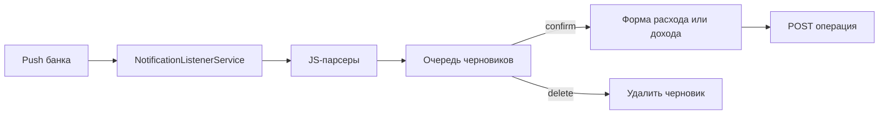
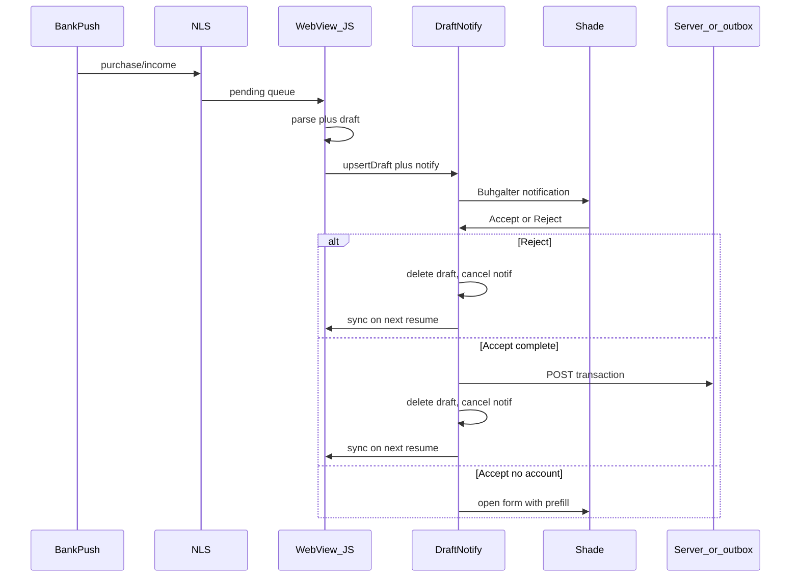
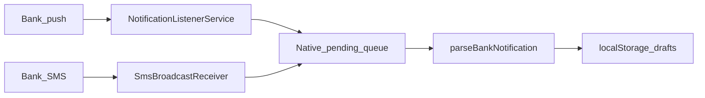

# Перехват уведомлений банка (Android)

Реализовано в **v1.5.0** ([ROADMAP](../ROADMAP.md#v150)).

## Зачем

В РФ у многих банков нет удобного открытого API для физлиц, но приходят **push** о списании. Если Android-клиент (с явного разрешения пользователя) читает такие уведомления, можно предложить создать расход: сумма, магазин, счёт — без ручного ввода и без зарубежного bank sync.

Ориентир — **только банки и сценарии внутри РФ**. Зарубежные агрегаторы (Plaid и т.п.) не рассматриваем.

## Решения

| Тема | Решение |
|------|---------|
| Канал MVP | Только **push** приложений банков (`NotificationListenerService`) |
| Фильтр | **Покупки/списания** → черновик расхода; **входящие** (пополнение, выплата процентов, перевод от …) → черновик дохода; OTP/баланс/отказы — игнор |
| Отмена покупки | Push «Отмена покупки» / refund → удалить черновик с той же суммой и магазином (окно 48 ч) |
| Подтверждение | Очередь локальных черновиков → форма расхода; **без** автосоздания |
| Отклонение | Любой черновик можно **удалить** без создания операции (подписки неотличимы от покупок) |
| Фон / MIUI | Нужны автозапуск и без оптимизации батареи — иначе NLS не живёт после смахивания приложения |
| Вкл/выкл | **Per-user** на устройстве; при выключении bindings **сохраняются** |
| Счёт | **last4 → счёт**, иначе fallback **банк/package → первый привязанный счёт** (несколько счетов могут указывать на один банк) |
| Магазин | Match справочника или предложение имени на форме; без автосоздания |
| Категория | При открытии черновика: если магазин из справочника — majority категории из последних 100 операций того же типа, затем majority непустой подкатегории; иначе primary. Правила — [category-rules-inbox.md](category-rules-inbox.md) |
| SMS | Follow-up после push MVP — см. секцию ниже и [ROADMAP](../ROADMAP.md) |
| Quick-actions в шторке | Не в MVP — спецификация ниже; реализация отложена |
| Платформа | Только Android |
| Сырые уведомления | Только на устройстве; на сервер — уже подтверждённая операция |

## Scope (v1.5.0)

| Возможность | Суть |
|-------------|------|
| Разрешение | Notification Listener — только после явного opt-in |
| Парсеры | Общие эвристики покупок; allowlist package для всех банков из каталога (`banks.ts`) |
| Черновик | Prefill: тип (расход/доход), сумма, дата, магазин/комментарий, счёт, категория/подкатегория (эвристика по истории merchant); подтверждение или удаление |
| Привязка | Счёт → банк (**many-to-one**: несколько счетов одного банка); карта `*XXXX` → счёт (приоритет) |
| Очередь | Локально на устройстве; не создавать операцию молча |

```mermaid
flowchart LR
  Push[Push банка] --> Listener[NotificationListenerService]
  Listener --> Parse[JS-парсеры]
  Parse --> Drafts[Очередь черновиков]
  Drafts -->|confirm| Form[Форма расхода или дохода]
  Drafts -->|delete| Drop[Удалить черновик]
  Form --> API[POST операция]
```

## Ограничения и риски

- Android ограничивает доступ к уведомлениям; нужны прозрачные объяснения в UI.
- **Разрешение ≠ bind слушателя:** на MIUI/HyperOS после выдачи доступа сервис часто не подключается. UI показывает статус слушателя и «Переподключить» (`requestRebind` + toggle component); иначе — выкл/вкл в системном списке, автозапуск/батарея.
- Тексты банков меняются — парсеры хрупкие; шаблоны в JS + vitest-фикстуры.
- Списание подписки выглядит как покупка — пользователь удаляет черновик вручную.
- SMS на новых Android жёстче ограничены (runtime `RECEIVE_SMS`); push остаётся основным каналом.

## Связь

- Магазины — [merchants-tags.md](merchants-tags.md) (уже реализованы; prefill из уведомления).
- Подписки — [subscriptions.md](subscriptions.md) (автосвязки нет).
- Правила категорий / очередь «разобрать» — [category-rules-inbox.md](category-rules-inbox.md) (позже).
- Выписка банка — [bank-sync.md](bank-sync.md).

## Follow-up: quick-actions в шторке (отложено)

Своё уведомление Buhgalter при появлении черновика: **Принять** / **Отклонить** без открытия Activity. Не автосоздание при push — операция только после явного «Принять» (или через текущий UI списка/формы).

| Тема | Решение |
|------|---------|
| Вкл/выкл | Настройки перехвата (`/settings/bank-notifications`): per-user тумблер «Уведомления в шторке» (default on). Активен только при включённом перехвате. Выкл. перехвата или тумблера → снять все наши draft-уведомления; черновики в списке и bindings сохраняются |
| Разрешение | `POST_NOTIFICATIONS` (API 33+); статус + запрос под тумблером. Без permission — только список в приложении |
| Отклонить | Удалить черновик, снять уведомление; Activity не открывать |
| Принять (полный черновик) | Создать операцию с полями черновика (тип, сумма, счёт, магазин, дата, категория), удалить черновик, снять уведомление — без Activity |
| Принять без счёта | Deep-link в форму с prefill (создать без `accountId` нельзя) |
| Тап по телу | Открыть список черновиков |
| Категория | Считать при **создании** черновика (`suggestCategoryFromMerchant`) и хранить на draft — Accept не зависит от WebView |
| Хранение | Зеркало черновиков в native (SharedPreferences); JS localStorage остаётся источником для UI; sync через Capacitor |
| Online Accept | Native `POST /api/v1/transactions` (токен/base как у виджетов, `WidgetSnapshotStore`) |
| Offline Accept | Native queue → при следующем старте JS → `createTransaction` / outbox |
| Парсинг | По-прежнему JS; наше уведомление — после `processPendingBankNotifications` (resume / `pendingAvailable`), не мгновенно при убитом процессе |

```mermaid
sequenceDiagram
  participant Bank as BankPush
  participant NLS as NLS
  participant JS as WebView_JS
  participant Native as DraftNotify
  participant User as Shade
  participant API as Server_or_outbox

  Bank->>NLS: purchase/income
  NLS->>JS: pending queue
  JS->>JS: parse plus draft
  JS->>Native: upsertDraft plus notify
  Native->>User: Buhgalter notification
  User->>Native: Accept or Reject
  alt Reject
    Native->>Native: delete draft, cancel notif
    Native->>JS: sync on next resume
  else Accept complete
    Native->>API: POST transaction
    Native->>Native: delete draft, cancel notif
    Native->>JS: sync on next resume
  else Accept no account
    Native->>User: open form with prefill
  end
```

Пункт в [ROADMAP](../ROADMAP.md) «Общие планы».

## Follow-up: SMS (после push MVP)

Тот же пайплайн черновиков, что у push: нормализация в `RawBankNotification` → JS-парсеры → localStorage-черновики. **Не** default SMS app / Role.

| Тема | Решение |
|------|---------|
| Захват | `BroadcastReceiver` + runtime `RECEIVE_SMS` |
| Opt-in | Тот же per-user `enabled` + блок permission SMS на `/settings/bank-notifications` |
| Банк | `smsSenders[]` в каталоге → `bankId` → primary `packageName` (bindings / `bankIdForPackage`) |
| Нормализация | `title`=отправитель, `text`=тело, `packageName`=primary package, `channel`=`sms`, `dedupeKey`=`sms\|sender\|ts\|hash(body)` |
| Дедуп push↔SMS | Помимо `rawHash`: `bankId+amount+kind+(last4)+(norm merchant)` в окне **2 ч** |
| Сырые SMS | Только на устройстве |
| Пустой `smsSenders` | SMS этого банка не ловим |

```mermaid
flowchart LR
  Push[Bank_push] --> NLS[NotificationListenerService]
  SMS[Bank_SMS] --> Recv[SmsBroadcastReceiver]
  NLS --> Pending[Native_pending_queue]
  Recv --> Pending
  Pending --> JS[parseBankNotification]
  JS --> Drafts[localStorage_drafts]
```

Пункт в [ROADMAP](../ROADMAP.md) (v1.5.1).

## Не входит

- Скрытый сбор уведомлений без opt-in.
- Отправка сырых уведомлений на чужой облачный сервис.
- Чтение всей SMS-ленты / ретроскан inbox / стать default SMS-приложением.
- Автосоздание операции без нажатия «Принять» / автосвязка с подпиской.
- Перенос JS-парсеров в native / уведомление до resume приложения.
- Actions на уведомлении банка (только на **нашем** уведомлении о черновике).
- Поддержка зарубежных банков.
