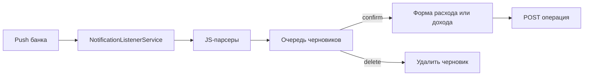

# Перехват уведомлений банка (Android)

Реализовано в **v1.5.0** ([ROADMAP](../ROADMAP.md#v150)).

## Зачем

В РФ у многих банков нет удобного открытого API для физлиц, но приходят **push** о списании. Если Android-клиент (с явного разрешения пользователя) читает такие уведомления, можно предложить создать расход: сумма, магазин, счёт — без ручного ввода и без зарубежного bank sync.

Ориентир — **только банки и сценарии внутри РФ**. Зарубежные агрегаторы (Plaid и т.п.) не рассматриваем.

## Решения

| Тема | Решение |
|------|---------|
| Канал MVP | Только **push** приложений банков (`NotificationListenerService`) |
| Фильтр | **Покупки/списания** → черновик расхода; **входящие** (пополнение, выплата процентов, перевод от …) → черновик дохода; OTP/баланс/отказы — игнор |
| Отмена покупки | Push «Отмена покупки» / refund → удалить черновик с той же суммой и магазином (окно 48 ч) |
| Подтверждение | Очередь локальных черновиков → форма расхода; **без** автосоздания |
| Отклонение | Любой черновик можно **удалить** без создания операции (подписки неотличимы от покупок) |
| Фон / MIUI | Нужны автозапуск и без оптимизации батареи — иначе NLS не живёт после смахивания приложения |
| Вкл/выкл | **Per-user** на устройстве; при выключении bindings **сохраняются** |
| Счёт | **last4 → счёт**, иначе fallback **банк/package → счёт** |
| Магазин | Match справочника или предложение имени на форме; без автосоздания |
| Категория | При открытии черновика: если магазин из справочника — majority категории из последних 100 операций того же типа, затем majority непустой подкатегории; иначе primary. Правила — [category-rules-inbox.md](category-rules-inbox.md) |
| SMS / шторка | Не в MVP — см. [ROADMAP](../ROADMAP.md) «Общие планы» |
| Платформа | Только Android |
| Сырые уведомления | Только на устройстве; на сервер — уже подтверждённая операция |

## Scope (v1.5.0)

| Возможность | Суть |
|-------------|------|
| Разрешение | Notification Listener — только после явного opt-in |
| Парсеры | Общие эвристики покупок; allowlist package для всех банков из каталога (`banks.ts`) |
| Черновик | Prefill: тип (расход/доход), сумма, дата, магазин/комментарий, счёт, категория/подкатегория (эвристика по истории merchant); подтверждение или удаление |
| Привязка | Счёт → банк (уведомления банка → этот счёт); карта `*XXXX` → счёт (приоритет) |
| Очередь | Локально на устройстве; не создавать операцию молча |

```mermaid
flowchart LR
  Push[Push банка] --> Listener[NotificationListenerService]
  Listener --> Parse[JS-парсеры]
  Parse --> Drafts[Очередь черновиков]
  Drafts -->|confirm| Form[Форма расхода или дохода]
  Drafts -->|delete| Drop[Удалить черновик]
  Form --> API[POST операция]
```

## Ограничения и риски

- Android ограничивает доступ к уведомлениям; нужны прозрачные объяснения в UI.
- **Разрешение ≠ bind слушателя:** на MIUI/HyperOS после выдачи доступа сервис часто не подключается. UI показывает статус слушателя и «Переподключить» (`requestRebind` + toggle component); иначе — выкл/вкл в системном списке, автозапуск/батарея.
- Тексты банков меняются — парсеры хрупкие; шаблоны в JS + vitest-фикстуры.
- Списание подписки выглядит как покупка — пользователь удаляет черновик вручную.
- SMS на новых Android жёстче ограничены — приоритет у push (SMS — follow-up).

## Связь

- Магазины — [merchants-tags.md](merchants-tags.md) (уже реализованы; prefill из уведомления).
- Подписки — [subscriptions.md](subscriptions.md) (автосвязки нет).
- Правила категорий / очередь «разобрать» — [category-rules-inbox.md](category-rules-inbox.md) (позже).
- Выписка банка — [bank-sync.md](bank-sync.md).

## Не входит

- Скрытый сбор уведомлений без opt-in.
- Отправка сырых уведомлений на чужой облачный сервис.
- SMS и quick-actions в шторке (общие планы).
- Автосоздание операции / автосвязка с подпиской.
- Поддержка зарубежных банков.
