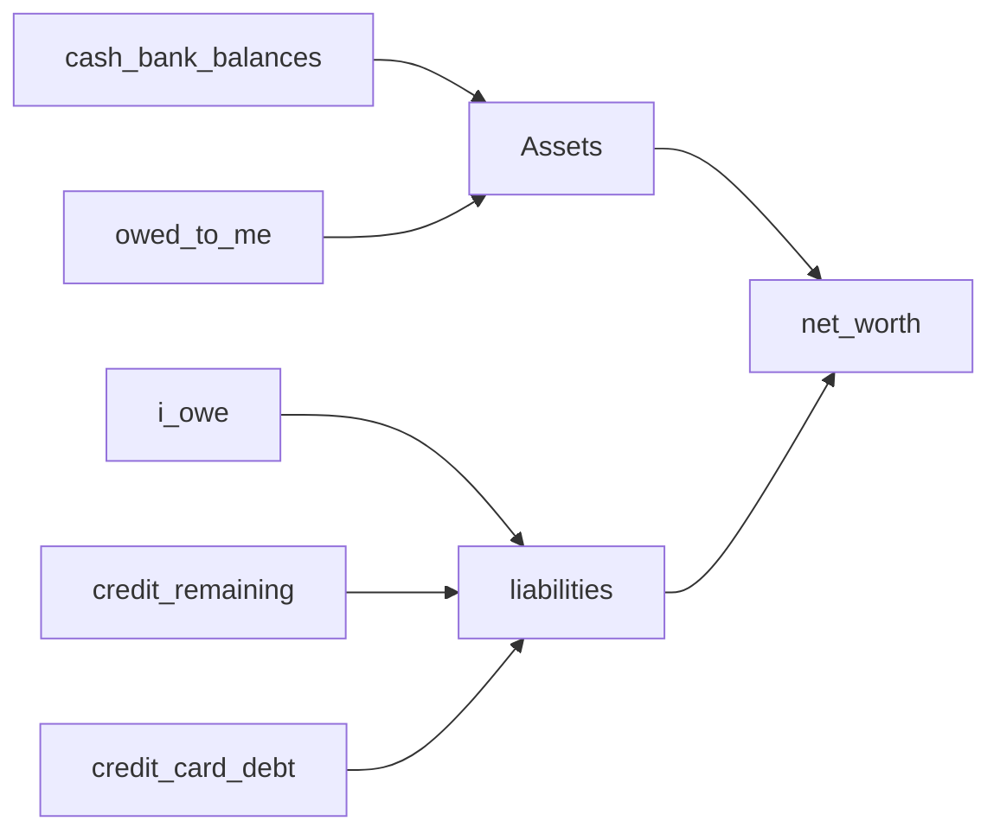

# Графики /stats и нетто-капитал

Планируется в **v1.5.0** ([ROADMAP](../ROADMAP.md#v150)). Сейчас на `/stats` — таблицы cashflow (`summary`, `by-category`, `by-period`); балансов во времени и нетто-капитала нет.

Связано: [docs/ui-stats.md](../docs/ui-stats.md), [ui-credit-cards.md](../docs/ui-credit-cards.md).

## Разделение клиентов

| Что | Web | Android |
|-----|-----|---------|
| `GET /stats/net-worth` | да | да |
| Блок нетто: текущее значение, assets/liabilities, ряд по месяцам | да | да (карточка + список) |
| Интерактивные графики (line / bars / donut) | **да** | **нет** |
| Cashflow-графики поверх `by-period` / `by-category` | **да** | нет (таблицы как сейчас) |

---

## Нетто-капитал

**Net worth** на дату `as_of` — активы минус обязательства (не «доход − расход за период»):

```
assets      = Σ balance(cash|bank)
            + Σ долги «мне должны» (owed_to_me)
liabilities = Σ долги «я должен» (i_owe)
            + Σ credits.remaining_amount (активные кредиты)
            + Σ max(0, credit_limit − balance) по credit_card
net_worth   = assets − liabilities
```

Задолженность по кредитке — использованный лимит: `max(0, limit − balance)` ([ui-credit-cards.md](../docs/ui-credit-cards.md)).

Истории снапшотов в БД нет: точка на дату пересчитывается из операций (`ComputeAllAsOf` и аналоги для долгов/кредитов).



---

## API

`GET /api/v1/stats/net-worth?from=&to=&group_by=month` — серия точек (конец месяца в TZ пользователя): `net_worth`, `assets`, `liabilities` и слагаемые (`cash_bank`, `owed_to_me`, `i_owe`, `credits_remaining`, `credit_cards_debt`) в копейках + `_display`.

---

## UI

**Web `/stats`:** под сводкой — line chart нетто, bar доходы/расходы (`by-period`), donut расходов по категориям; таблицы ниже сохранить. Библиотека: Chart.js.

**Android stats:** текущий нетто + расшифровка + список по месяцам **без** графиков.

---

## Вне scope

- Графики на Android; дневная/недельная сетка нетто; снапшоты в БД; прогноз вперёд; мультивалютный пересчёт ([multicurrency.md](multicurrency.md)).
