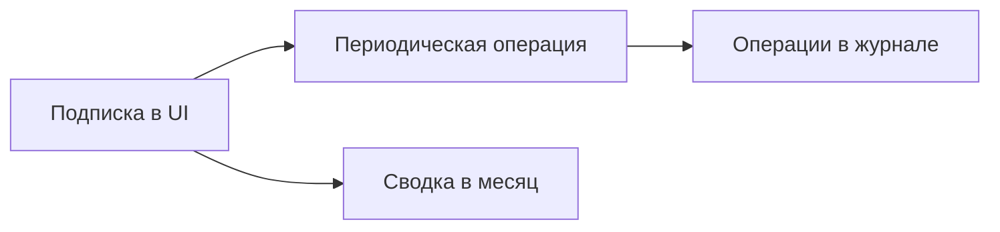

# Подписки (отдельно от периодических операций)

Планируется в **v1.5.0** ([ROADMAP](../ROADMAP.md#v150)).

## Зачем

Сейчас повторяющиеся платежи за сервисы (Netflix, интернет, облако, членства) живут как **периодические операции**. По смыслу это почти то же самое, но UX другой: нужен экран «сколько горит в месяц на подписки», ближайшие списания, логотипы сервисов — а не общий список всех шаблонов (зарплата, аренда, коммуналка).

Периодические операции **остаются** ядром (создание проводок по расписанию). Подписки — **удобный слой** поверх них (или тонкая сущность, которая порождает периодическую операцию).

## Что уже есть

- Периодические операции: шаблон → создание дохода/расхода/перевода по расписанию.
- Уведомления (Telegram / MAX) по событиям.
- Нет отдельного раздела «Подписки», нет «сумма подписок в месяц», нет календаря продлений и иконок сервисов.

## Scope (v1.5.0)

| Возможность | Суть |
|-------------|------|
| Экран «Подписки» | Список активных подписок: название, сумма, период, следующая дата, категория, счёт |
| Связь с периодическими | Подписка = периодическая операция расхода (или ссылка на неё); без дублирования двух несвязанных механизмов |
| Сводка | «В месяц / в год уходит на подписки» (приведение разных периодов к месяцу) |
| Ближайшие | Блок «скоро списание» (N дней) |
| Иконки / логотипы | Опционально: иконка категории или загрузка/выбор картинки сервиса |
| CRUD | Создать / изменить / выключить / удалить с тем же подтверждением, что у периодических |

## Не входит

- Отдельный продукт «как Wallos» без связи с журналом операций.
- Автообнаружение подписок из истории банка (это уже ближе к правилам + банк / выписка, позже).
- Советы нейросети «какой тариф выгоднее».

## Открытые вопросы

- [ ] Подписка — отдельная таблица `subscriptions` → `recurring_operation_id`, или только фильтр/метка «это подписка» на периодической?
- [ ] Годовые и «раз в N месяцев» — как показывать в «в месяц»?
- [ ] Переводы (например автопополнение) считать подписками или нет?

## Связь

- Периодические операции (текущий код / UI).
- Уведомления — можно позже слать «завтра спишется подписка X».
- Бюджет и графики — подписки как обычные расходы после создания операции.
