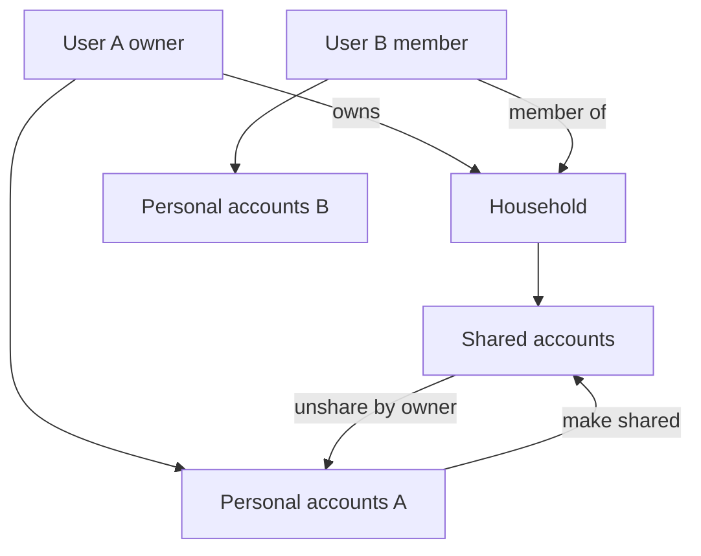
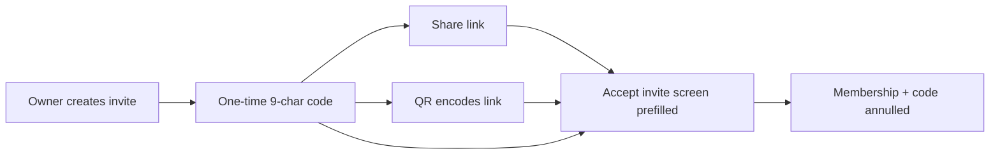

# Семья / команда

**Статус:** спецификация зафиксирована (2026-08-05). Реализация **отложена** — пункт в [ROADMAP](../ROADMAP.md) → «Общие планы», не в ближайшем релизе.

Несколько пользователей на одном self-hosted инстансе ведут **общие (семейные) счета**, сохраняя **личные**. Сейчас каждый `user_id` полностью изолирован ([data-model.md](../docs/data-model.md)).

## Зачем

Семье или малой команде нужен общий учёт с ролями, без слияния всех личных историй в одну кучу и без обязательного «пустого» аккаунта у приглашённого.

## Модель (hybrid)

Не «всё в household» и не «только шаринг отдельных счетов без группы».

- Сущность **household** (семья / команда).
- Пользователь состоит **максимум в одной** группе.
- У каждого всегда есть **личные** счета (как сейчас до вступления).
- **Семейные** счета принадлежат household; видны всем членам.
- При вступлении личные счета **не трогаются**. Общие появляются только явно: «создать семейный» или «сделать счёт общим».

## Роли

| Роль | Кто |
|------|-----|
| `owner` | Создатель группы; ровно один на household |
| `member` | Остальные участники |

**Только owner:** приглашать, отзывать инвайт, кикать, transfer ownership, unshare счёта в личные, распускать группу.

**Owner не может выйти** из группы, пока владеет ею. Сначала transfer другому member (или роспуск — см. ниже).

### Матрица прав (MVP)

| Действие | owner | member |
|----------|-------|--------|
| Создать / править / удалять операции на общих счетах | да | да |
| Создать семейный счёт | да | да |
| Сделать свой личный счёт общим | да | да |
| Вернуть общий счёт в личные (unshare) | да | нет |
| Пригласить / отозвать код | да | нет |
| Кикнуть участника | да | нет |
| Передать владение | да | нет |
| Выйти из группы | нет | да |
| Распустить группу | да | нет |
| Видеть чужие личные счета | нет | нет |

Админ **инстанса** ≠ admin household: управляет users как сейчас, не членством в семье.

## Жизненный цикл группы

1. User **без** группы создаёт household → становится `owner`. Личные счета остаются личными.
2. Owner создаёт **инвайт** (один код → ссылка / QR / ручной ввод).
3. Другой user (тоже без группы) принимает инвайт → `member`. Его личные счета не меняются.
4. Участники создают семейные счета и/или делают личные общими.
5. Member может **выйти**; owner — только после transfer (или роспуск).
6. Owner может **кикнуть** member (не себя).
7. Owner может **передать** роль другому member; бывший owner становится member и может выйти.
8. Owner может **распустить** группу (см. «Роспуск»).

### Выход и кик

Для вышедшего / кикнутого:

- Личные (не расшаренные) счета остаются.
- Доступа к household и **всей истории общих счетов** нет — «как будто никогда не был в семье».
- У остальных данные семьи **сохраняются** (в том числе операции, которые создал вышедший).
- Счета, ранее сделанные общими этим пользователем, **остаются в household**. Вернуть в личные — только unshare **до** выхода (делает owner).

### Transfer ownership

- Только явная операция owner → выбранный **member** той же группы.
- Не происходит автоматически при кике.
- После transfer ровно один новый owner.

### Роспуск

- Только owner.
- Допустимо, когда owner — **единственный** оставшийся член (после выхода/кика остальных) **или** с явным подтверждением, если в группе ещё есть members (они теряют доступ, «как при кике»).
- Общие счета с известным исходным владельцем (`original_owner_user_id`) возвращаются ему как личные; счета, созданные сразу как семейные, становятся личными у owner, который распускает группу.
- Каталог категорий household удаляется вместе с группой (личные категории users не трогаем).
- Инвайты pending аннулируются.

## Инвайты

Создаёт только **owner**. Один код обслуживает три канала показа.

| Канал | Поведение |
|-------|-----------|
| **9-значный код** | Латинские буквы + цифры; отображение `XXX-XXX-XXX`; ввод с дефисами или сплошняком — нормализация к 9 символам |
| **Ссылка** | `{base}/invite/{code}` (path при реализации можно уточнить, семантика та же). Открывает web или Android на экране **«Принять приглашение»** с подставленным кодом |
| **QR** | Кодирует ту же ссылку → тот же экран accept с prefill |

### База ссылки (`base`)

1. Если задан `system_settings.external_url` — использовать его (как для ссылок в уведомлениях).
2. Если пуст — **локальный origin** текущего доступа к инстансу (host запроса / LAN). Настраивать внешний URL для инвайтов **не обязательно**; accept по локальной ссылке должен работать.

### Жизненный цикл кода

`pending` → при успешном accept → **annulled/used** (одноразовый). Повторный accept того же кода — ошибка.

- Owner может **отозвать** неиспользованный код.
- TTL неиспользованного кода: **7 суток** (затем недействителен).
- Accept только если приглашённый **ещё не состоит** в другой группе (и не owner другой).

### Android / deep link

QR и ссылка ведут в раздел accept invite с prefill кода. Если пользователь ещё не привязан к серверу — обычный server-setup / login, затем экран с уже подставленным кодом.

## Владение данными

| Область | Владение |
|---------|----------|
| Профиль (`language`, `timezone`, `theme`, `currency` отображения) | user |
| Личные счета и операции по ним | user |
| Семейные счета и операции по ним | household; `created_by_user_id` — кто внёс |
| Категории для личных операций | user |
| Категории для операций на общих счетах | каталог **household** (при создании группы — копия категорий owner) |
| Бюджет, долги, кредиты, подписки, recurring | по счетам: личный счёт → user; общий → household |
| Сессии, API-токены, каналы уведомлений | user |
| События по общим счетам (уведомления) | рассылка member’ам с настроенным каналом |

Статистика: раздельно личное / семья / «всё видимое мне»; **не** суммировать чужие личные счета.

## Счета: share / unshare

| Действие | Кто | Эффект |
|----------|-----|--------|
| Создать семейный | любой member/owner | `household_id` set; нет личного владельца-источника (или `original_owner` = создатель — на усмотрение реализации, для роспуска см. выше) |
| Сделать общим | владелец личного счёта (член группы) | счёт переходит household; виден всем членам; запомнить исходного user |
| Сделать личным (unshare) | только owner группы | счёт возвращается исходному `original_owner_user_id` |

## Миграция существующих установок

- Все текущие счета остаются **личными**; поведение соло-пользователя без группы **не меняется**.
- Household появляется только при create/join.
- Обратная совместимость API для клиентов без семьи: данные user = его личные (+ общие, если состоит в группе).

## API-контур (черновик, не реализовано)

Ориентир для будущей реализации (имена уточняемы):

- `POST/GET /households`, `GET /households/me`
- Members: list, kick, leave, transfer-ownership, dissolve
- Invites: create (возвращает code + url + данные для QR), revoke, `POST /invites/accept`
- Accounts: флаги/поля `visibility` / `household_id` / `original_owner_user_id`; actions share / unshare
- Transactions: фильтр по видимости; `created_by_user_id` в ответах

Доступ: сессия/API-токен user; scope = личное + membership.

## UI (web + Android)

- Настройки: семья — участники, роли, инвайт (код + копирование ссылки + QR), accept, transfer, leave/kick, dissolve.
- Счета: бейдж «личный» / «семейный»; действия share/unshare.
- Список операций по общим: кто создал.
- Android: тот же контракт; deep link на accept. Share/unshare и смена membership — **online-first**; сложный offline-merge общих счетов — later.

Кеш API (`u:{user_id}:*` и ref-cache) при реализации учесть invalidation при смене membership.

## Безопасность

- Нет доступа к чужому household и к личным счетам других members.
- После leave/kick — нулевой доступ к истории семьи (чтение API/UI).
- Одноразовые инвайт-коды; не угадываемые (криптостойкая генерация из алфавита).
- Instance admin не обходит изоляцию household «по роли семьи».

## Out of scope (не в этой спецификации)

- Несколько household на одного user / переключатель групп.
- Роль `viewer` / granular ACL по счетам.
- Автослияние двух живых историй при вступлении.
- Долги «между членами семьи» как отдельная сущность.
- Жёсткий лимит участников на self-hosted.
- SSO / OIDC «вход через организацию».

Связь с [multicurrency.md](multicurrency.md) — ортогональна (валюта на счёте не зависит от семьи).

## Критерии готовности реализации (когда возьмём в работу)

- [ ] Миграции + изоляция запросов personal/household
- [ ] Инвайт: код / ссылка / QR, TTL, revoke, одноразовый accept, base = external_url или local origin
- [ ] Deep link Android → accept с prefill
- [ ] Share / unshare / семейный счёт
- [ ] Leave / kick / transfer / dissolve по правилам выше
- [ ] UI web + Android: участники, бейджи счетов, «кто создал»
- [ ] E2E: два пользователя, общий счёт, выход = полная потеря видимости истории семьи
- [ ] Документация `docs/data-model.md` + OpenAPI

## Зависимости

Стабильная модель владения данными; audit действий invite/kick/transfer/dissolve желателен при реализации.
