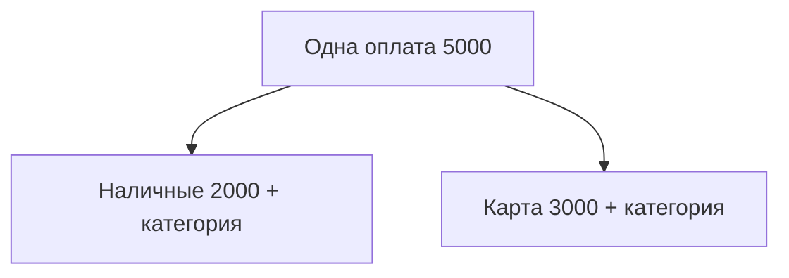

# Разбивка операции на несколько счетов

Планируется в **v1.6.0** ([ROADMAP](../ROADMAP.md#v160)).

## Зачем

Одна реальная оплата иногда относится к **разным счетам** учёта (не только к разным категориям): часть с наличных, часть с карты; или одна покупка учитывается как несколько списаний по разным «карманам».

Сейчас: одна операция = один счёт, одна сумма, одна категория.

## Scope (v1.6.0)

| Возможность | Суть |
|-------------|------|
| Разбивка по счетам | Итоговая сумма оплаты = сумма частей; каждая часть: счёт + сумма (+ категория/подкатегория по необходимости) |
| Балансы | Каждый счёт уменьшается/увеличивается на свою часть |
| UI | В форме расхода/дохода: «разбить» → строки частей; проверка суммы частей = итог |
| Статистика / бюджет | Считают по частям (явная семантика в API и UI) |

## Отличие от разбивки только по категориям

Классический «split по категориям» (одна карта → еда + быт) тоже полезен. В этом пункте акцент пользователя — **несколько счетов**. Реализация может закрыть оба сценария одной моделью «строки частей» (счёт и/или категория на строке).

## Связь

- Магазины/теги — [merchants-tags.md](merchants-tags.md) (v1.5.0).
- Бюджет — факт по частям должен попадать в правильные лимиты.
- Импорт / выписка банка — обычно одна строка банка; разбивка вручную после импорта.

## Открытые вопросы

- [ ] Одна parent-операция с children или набор связанных операций с общим `group_id`?
- [ ] Переводы между своими счетами уже есть — не путать с разбивкой расхода.
