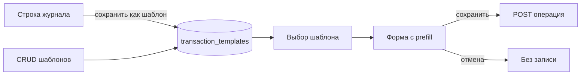

# Шаблоны операций

Планируется в **v1.5.0** ([ROADMAP](../ROADMAP.md#v150)). Web + Android + сервер.

Именованные пресеты полей операции для **быстрого ручного** создания частых доходов, расходов и переводов. Пользователь выбирает шаблон → открывается форма с подставленными полями → при необходимости правит → сохраняет. **Без** автосоздания по расписанию.

Соседи (не путать): [«Повторить»](../docs/transactions-display.md) из истории, [периодические операции](../docs/data-model.md), [подписки](subscriptions.md), [правила категорий](category-rules-inbox.md), [черновики из уведомлений](notification-intercept.md).

---

## Зачем

Типичные повторяющиеся, но **нерегулярные** платежи: обед в столовой, проезд, бензин, перевод «маме», чаевые — вводятся часто, а «Повторить» требует найти прошлую строку. Периодические и подписки создают операции сами по календарю — для обеда это лишнее.

Шаблоны — справочник пресетов: один тап с главной / из панели быстрого добавления, без поиска по журналу и без scheduler.

---

## Отличия от соседних механик

| Механика | Что делает | Когда использовать |
|----------|------------|-------------------|
| **Шаблон** | Сохранённый пресет → форма создания; дата «сейчас»; пользователь подтверждает | Часто, но без жёсткого расписания |
| **Повторить** | Prefill из конкретной строки журнала; шаблон не сохраняется | Разовая копия «как вчера» |
| **Периодическая** | Scheduler создаёт операцию по `period` / `next_run_at` | Зарплата, алименты, аренда |
| **Подписка** | Отдельный UX поверх регулярных списаний сервисов | Netflix, мобильная связь |
| **Правило категории** | Автоподстановка категории/счёта по условию | Разметка входящих/импорта |
| **Черновик уведомления** | Prefill с Android push банка | Покупка уже случилась в банке |

Шаблон **не** запускает scheduler и **не** является черновиком операции в БД операций.

---

## Решения

| Тема | Решение |
|------|---------|
| Сущность | Отдельная таблица `transaction_templates` (per-user), не флаг на `transactions` / `recurring_operations` |
| Типы | `expense`, `income`, `transfer` — как у обычных форм |
| Применение | Только **открыть форму** с prefill; операция создаётся обычным `POST /transactions` (или transfer) после подтверждения |
| Дата / время | При применении всегда **текущие** (как у «Повторить»); в шаблоне не храним |
| Сумма | Опциональна: фиксированная или пустая (пользователь вводит при создании) |
| Имя | Обязательное короткое название для UI (`«Обед»`, «Бензин», «Маме») |
| Иконка | Опциональна; иначе — иконка категории / тип операции |
| Порядок | `sort_order` + drag-and-drop в списке шаблонов |
| Из журнала | «Сохранить как шаблон» в меню «⋯» строки (те же ограничения, что у «Повторить» / «Сделать периодической») |
| Управление | **Отдельная страница** на web и Android (CRUD, порядок); не встраивать CRUD в главную |
| Применение на главной | Блок «Шаблоны» на главной: **спойлер** (`
`), **перед** виджетом бюджета; тап по шаблону → форма с prefill |
| Feature flag | `transaction_templates` (см. [feature-toggles.md](feature-toggles.md)) |
| Офлайн Android | CRUD шаблонов через outbox по тем же правилам, что справочники; применение — локальный prefill формы |

---

## Модель данных

### Таблица `transaction_templates`

| Колонка | Тип | Описание |
|---------|-----|----------|
| `id` | TEXT PK | UUID |
| `user_id` | TEXT FK → users | Владелец |
| `name` | TEXT NOT NULL | Отображаемое имя |
| `type` | TEXT NOT NULL | `expense` \| `income` \| `transfer` |
| `account_id` | TEXT NULL FK → accounts | Счёт (для дохода/расхода); у перевода — «откуда» |
| `to_account_id` | TEXT NULL FK → accounts | Только `transfer` — «куда» |
| `category_id` | TEXT NULL FK → categories | Доход/расход |
| `subcategory_id` | TEXT NULL | Доход/расход |
| `amount` | INTEGER NULL | Минорные единицы; `NULL` = ввести при создании |
| `description` | TEXT NULL | Описание / комментарий |
| `merchant_id` | TEXT NULL FK → merchants | Если модуль магазинов включён |
| `icon` | TEXT NULL | Ключ иконки (как у категорий) или `NULL` |
| `sort_order` | INTEGER NOT NULL DEFAULT 0 | Порядок в списках и quick-add |
| `created_at` / `updated_at` | TEXT | ISO-8601 |

Теги шаблона — отдельная M2M `transaction_template_tags (template_id, tag_id)`, по аналогии с `transaction_tags`. При выключенном `merchants_tags` поля магазина/тегов в API игнорируются / скрываются в UI.

Ограничения:

- `type = transfer` → обязательны `account_id` и `to_account_id`, разные; `category_id` / `subcategory_id` / `merchant_id` — `NULL`.
- `type` income/expense → `to_account_id` = `NULL`; категория того же `type`, что шаблон.
- Счета/категории/магазины должны принадлежать пользователю и быть активны на момент **создания/обновления** шаблона. При **применении**: если сущность удалена/архивирована — форма открывается с пустым полем и toast/предупреждением (не блокировать весь шаблон).
- Комиссия перевода в шаблоне **не** хранится в MVP (как опциональное поле — follow-up).

---

## API

Базовый путь: `/api/v1/transaction-templates`. При `transaction_templates = false` → `FEATURE_DISABLED` (как у других модулей).

| Метод | Путь | Суть |
|-------|------|------|
| `GET` | `/transaction-templates` | Список пользователя, сортировка `sort_order`, затем `name` |
| `POST` | `/transaction-templates` | Создать |
| `GET` | `/transaction-templates/{id}` | Одна запись |
| `PUT` | `/transaction-templates/{id}` | Обновить поля |
| `DELETE` | `/transaction-templates/{id}` | Удалить |
| `PUT` | `/transaction-templates/reorder` | Тело: упорядоченный массив `id` → перезапись `sort_order` |
| `POST` | `/transaction-templates/{id}/apply` | **Не** создаёт операцию. Возвращает DTO prefill для формы (см. ниже) |

Альтернатива без `apply`: клиент сам мапит поля шаблона в props формы (`repeatFrom`-подобный объект). Тогда `apply` можно не делать в MVP — достаточно GET одного шаблона. Если оставляем `apply` — удобно централизовать «обнулить дату, проверить живость ссылок, отфильтровать мёртвые теги».

### Prefill DTO (ответ apply / клиентский маппинг)

Совместим по смыслу с `repeatFrom` у `TransactionForm` / `TransferForm`:

- `type`, `account_id`, `to_account_id`, `category_id`, `subcategory_id`, `amount` (или отсутствует), `description`, `merchant_id`, `tag_ids`
- `date` / время **не** отдаём — форма ставит «сейчас»
- Флаги предупреждений: `account_missing`, `category_missing`, … — опционально

Создание операции после подтверждения — существующие эндпоинты; шаблон в теле create **не** передаётся (нет обязательной связи template→transaction в MVP).

### Кеш

Список шаблонов — справочник: инвалидация ref-cache / Android query cache при CRUD (как merchants/tags).

---

## UI

### Управление (web + Android)

Отдельная страница CRUD шаблонов на обеих платформах — не смешивать с главной и не прятать CRUD только в модалку «на лету».

| Платформа | Маршрут / место |
|-----------|-----------------|
| Web | Например `/settings/transaction-templates` (пункт в настройках) |
| Android | Отдельный экран в настройках, тот же смысл |

На странице: список, создать / изменить / удалить, drag-and-drop `sort_order`. Форма шаблона — те же контролы, что у операции (счёт, категория, сумма с возможностью оставить пустой — «Указывать сумму при создании», описание, магазин, теги). Без даты. Пустое состояние — по [ui-empty-states.md](../docs/ui-empty-states.md).

### Главная: добавление операции по шаблону (web + Android)

На главной (`/` / home) — блок **перед** виджетом бюджета ([ui-budget.md](../docs/ui-budget.md)):

1. Спойлер (`
`), заголовок вроде «Шаблоны» / «Из шаблона».
2. По умолчанию **свёрнут** (как спойлер категорий у бюджета).
3. Внутри — компактный список: иконка + имя + сумма (если задана), порядок `sort_order`.
4. Тап по строке → модалка `TransactionForm` / `TransferForm` с prefill (дата «сейчас»).
5. Если шаблонов нет — блок **не показывать** (или одна строка-ссылка на страницу управления; предпочтение MVP — скрыть).
6. Ссылка «Управлять» / «Все шаблоны» внутри спойлера или рядом с заголовком → страница управления.

Порядок блоков на главной (фрагмент): … → **спойлер шаблонов** → **виджет бюджета** → …

Не дублировать быстрый выбор шаблонов на `/transactions` и в bottom-sheet кнопок Доход/Расход/Перевод в MVP.

### Из журнала

В `TransactionList` пункт «Сохранить как шаблон»: диалог имени (дефолт — описание или «Категория · сумма»), сохранение остальных полей из строки. Недоступно там же, где недоступны «Повторить» / системные категории / credit-linked. После сохранения — toast; переход на страницу управления не обязателен.

### Android: офлайн

Список на главной и на странице управления — из локального кеша; CRUD через outbox. Применение шаблона — локальный prefill формы, create операции — как обычно (online / outbox).

### Лимиты UX

- Soft-limit в спойлере на главной: первые N по `sort_order` (например 8–12); дальше — ссылка на страницу управления.
- Hard-limit в API на число шаблонов на пользователя (например 100) — защита от мусора; при превышении — 400 с понятным кодом.

---

## Scope (v1.5.0)

Feature flag: `transaction_templates` (default `true` при появлении модуля).

| Возможность | Суть |
|-------------|------|
| CRUD шаблонов | Отдельная страница web + Android; expense / income / transfer |
| Теги / магазин | Если включён `merchants_tags` |
| Порядок | `sort_order` + reorder API |
| Быстрый выбор | Главная: спойлер **перед бюджетом** (web + Android) |
| Из журнала | «Сохранить как шаблон» |
| Применение | Prefill формы; create обычным API |
| i18n | `en` / `ru` строки UI |

---

## MVP (порядок работ)

1. Миграция + sqlc + OpenAPI CRUD (+ reorder).
2. Флаг `transaction_templates` в реестре feature-toggles, гейты API/навигации.
3. Web: страница управления + спойлер шаблонов на главной (перед бюджетом) + пункт в меню строки.
4. Android: то же + outbox/кеш.
5. Тесты: API (CRUD, валидация transfer/income, мёртвые ссылки при apply), vitest маппинга prefill; e2e — по желанию пользователя отдельно.
6. Release notes / краткая строка в [transactions-display.md](../docs/transactions-display.md) после реализации.

---

## Не входит

- Автосоздание операции по шаблону без подтверждения.
- Расписание, cron, «каждый день в 13:00» — это recurring / subscriptions.
- Конвертация шаблон ↔ периодическая / подписка в одну кнопку (можно вручную создать recurring из тех же полей позже).
- Сумма с формулой / случайным диапазоном.
- Шаблоны комиссий кредита, долговых settle, системных категорий.
- Общие (team) шаблоны — после [team-collaboration.md](team-collaboration.md).
- Виджет Android home-screen / quick-settings только под шаблоны (follow-up).
- Связь `transactions.template_id` для аналитики «из какого шаблона» (follow-up, если понадобится).

---

## Связь

| Документ | Связь |
|----------|-------|
| [transactions-display.md](../docs/transactions-display.md) | Формы, «Повторить», меню строк |
| [merchants-tags.md](merchants-tags.md) | Опциональные поля магазина и тегов |
| [feature-toggles.md](feature-toggles.md) | Флаг модуля |
| [category-rules-inbox.md](category-rules-inbox.md) | Правила — про авторазметку, не про пресеты |
| [subscriptions.md](subscriptions.md) / recurring | Регулярное автосоздание |
| [notification-intercept.md](notification-intercept.md) | Черновики с устройства, не шаблоны |
| [android-client-platform.md](../docs/android-client-platform.md) | Outbox / кеш справочников |

---

## Follow-up

- Android: pinned templates в шторке / app shortcuts.
- Опциональная комиссия в шаблоне перевода.
- «Создать периодическую из шаблона».
- Статистика использования / сортировка по частоте применения (если появится `template_id` на операции).
- Подсказки «часто вводите так — сохранить шаблон?» после N одинаковых ручных операций.

---

## Открытые вопросы

- [ ] `POST …/apply` на сервере или только клиентский маппинг из GET?
- [ ] Пустая сумма: явный флаг `amount_fixed` или достаточно `amount IS NULL`?
- [ ] При архивации счёта из шаблона — очищать `account_id` сразу (фон/при чтении) или только предупреждать при apply?
- [ ] Пустой список шаблонов: полностью скрыть спойлер на главной или показать ссылку «Добавить шаблон»?
